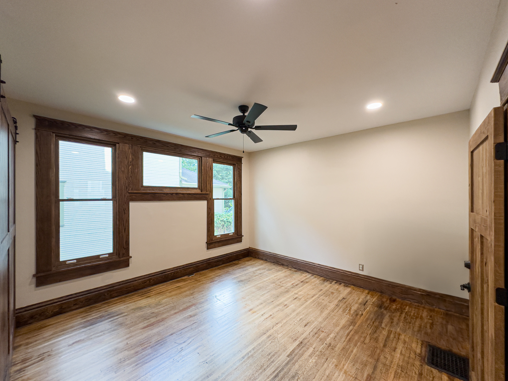
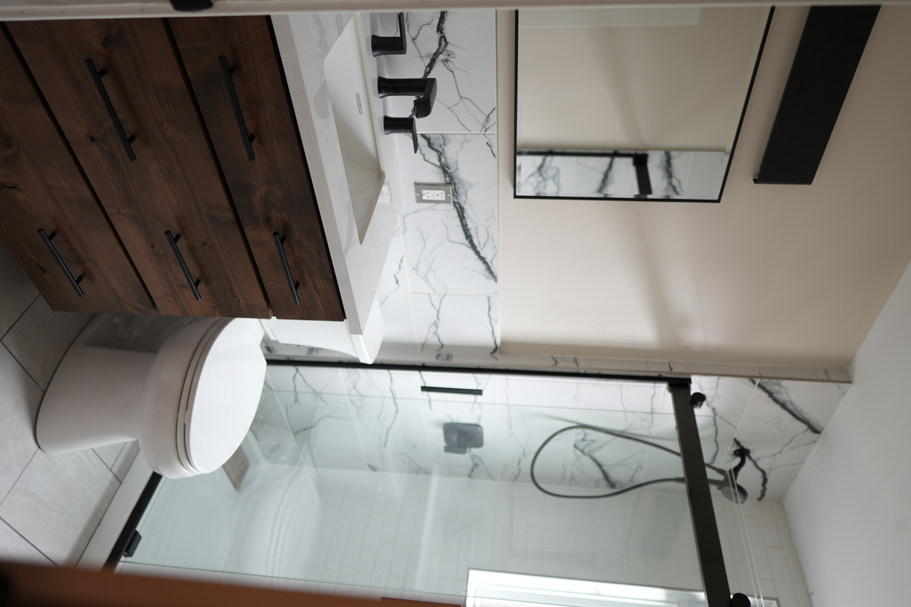
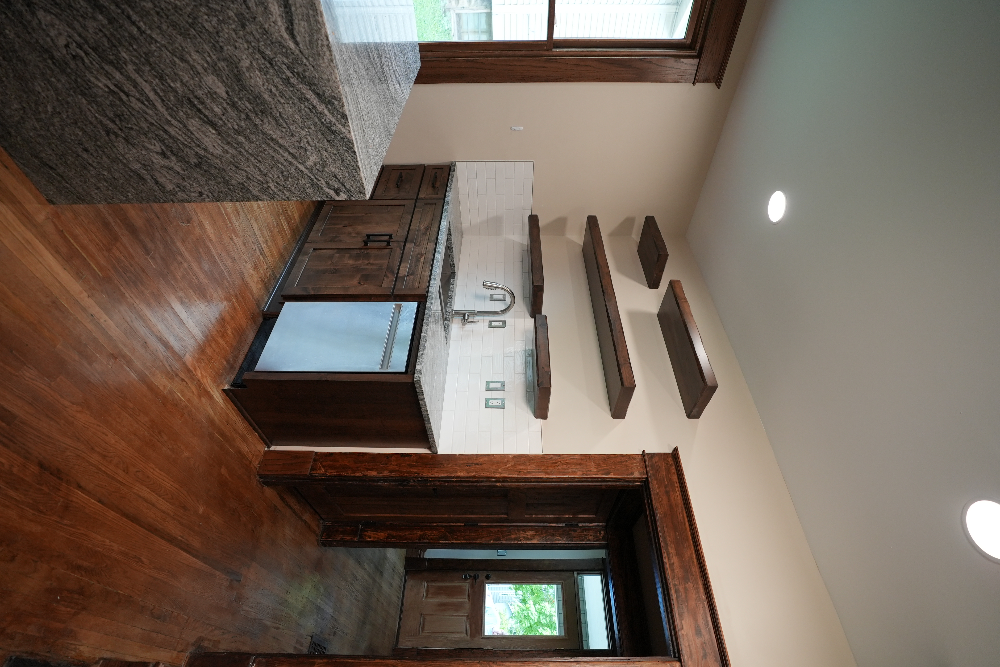
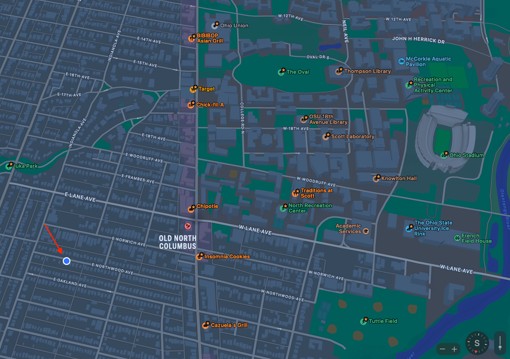
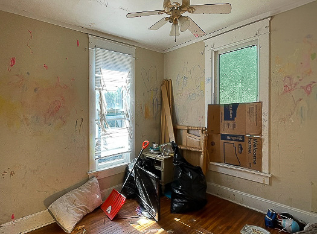

    
    <h1 style="text-align: center; flex: .5;">204 E Oakland</h1>
    

---

**Why rent here?**  
 Well, there are 3 reasons you'll love your stay. Plus, at the bottom you'll learn how I got started in real estate as an OSU student.

<a href="#1" class="jump-to">Renovation</a>  
<a href="#2" class="jump-to">Location</a>  
<a href="#3" class="jump-to">Dedication</a>  

  

  

    

      

        
      

      

        Hi, I'm Brian. While I was working towards my masters degree, 204 started as my personal project. Now, its managed by 204 E Oakland LLC.
      

    

  

  

  

## Renovation
---

204 has modern rennovations and historic detail. With oak flooring, beautiful trimwork, and granite countertops, the home is well stylized. At the same time, the home features central air, updated appliances, and two full bathrooms. Oh and there are up to 5 bedrooms.

Take a look at these photos, taken in July of 2023. 

<section class="container">
	

		

      
      
      
      
      
      
      
      
      
      
      
      
		

		

			
			
			
      
      
      
      
      
      
		

	

</section>

You can check out the image gallery (coming soon) to see even more photos.

## Location
---

While 204 is close to campus, the beauty of the tree lined street brings you out of the city and into something that feels more like *Your place*.

  

  

The short walk to north campus, is very bikeable and walkable. It took me about 12 minutes to walk to Scott traditions, 8 minutes to make it to the Starbucks on high and lane, and about 25 minutes to the Ohio Union. 

  

While the home is within walking distance of most places, off street parking is also available for up to 3 cars. On top of that, there is permit street parking. 

## Dedication
---

You wont find many people that care more about customer service and providing a good place to live - in part because I renovated the home myself.

Despite being a smaller operation, I have the capability to fix any issues that may arise thanks to having the proper connections and from having a healthy emergency fund and proper management plan.

## Apply here
---

Currently accepting applications for the *2025-2026* school year. Rent of 4200 monthly.

<a href="https://mystudentrental.co/apply/" target="_blank">
  <button class="button">Apply Now!</button>
</a>

## About me
---

Hi, I'm Brian. I started in real estate during my time at Ohio State where I received my bachelors and masters in mechanical engineering. Now, I balance working as a robotics engineer and managing/maintaining this rental. 

As good as it sounds, everything was *not* always easy..

<link
  rel="stylesheet"
  href="https://cdn.jsdelivr.net/npm/img-comparison-slider@8/dist/styles.css"
/>

  
    
    
  </img-comparison-slider>

In fact, my first few years were very rough - I let my rental get destroyed by the very first tenants that stayed there.

After those tenants were gone, I spent the next year rehabing the entire home, during the time I was studying engineering and enrolled in my masters program.

Anyways, if you're interested in renting the house, <a href="https://mystudentrental.co/apply/" style="color: #ff5b15; font-size: 1.25em; text-decoration: none;" onmouseover="this.style.textDecoration='underline'" onmouseout="this.style.textDecoration='none'">Apply here!</a>

